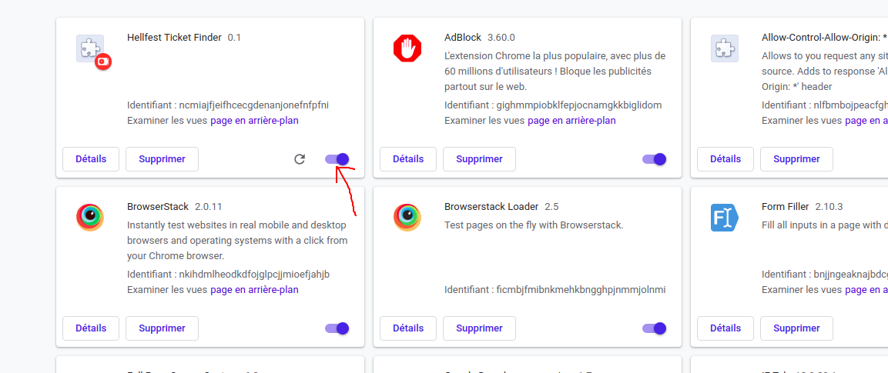

# hellfest
## Charger l'extention dans chrome

Pour charger l'extention dans chrome  
1- URL: chrome://extensions/  
2- Cliquer sur Developer mode  
3- Cliquer sur Chargez l'extension non empaquetée  
4- Choisir le dossier contenant l'extention  
5- Verifier que l'extensions est bien actif cf capture ci-dessous
  
L'extention devrait être visible dans la bar de extention (symbolisé par un H)  