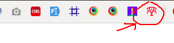

# hellfest
## Charger l'extention dans chrome

Pour charger l'extention dans chrome  
1- URL: chrome://extensions/  
2- Cliquer sur Developer mode  
3- Cliquer sur Chargez l'extension non empaquetée  
4- Choisir le dossier contenant l'extention  
5- Verifier que l'extensions est bien actif cf capture ci-dessous
  
L'extention devrait être visible dans la bar de extention (symbolisé par un petit trophé cf capture)  
  

##Utiliser le plugin sur ticketswap  
1- Aller sur la page voulu sur ticketSwap  
2- Bien aller jusqu'à la page où ce trouve les tickets en vente et déjà vendu cf capture.  
  
3- Une fois sur la bonne page, clique sur l'icon de l'extention installer juste avant.  

La page va se recharger automatiquement jusqu'à qu'un ticket arrive. Si un ticket est mit en vente le script redirigera automatiquement sur la page panier avec le ticket à l'intérieur ;)  

Il y a plus qu'à laisser tourner le script dans l'onglet en espérant trouver le ticket.  
**ATTENTION**: Ne pas fermer l'onglet. On peut l'utiliser que pour un seul onglet malheureusement :(

##Arret du plugin
A la fin de la recherche avant de fermer l'onglet, bien recliquer sur l'icon pour arrêter correctement le plugin 